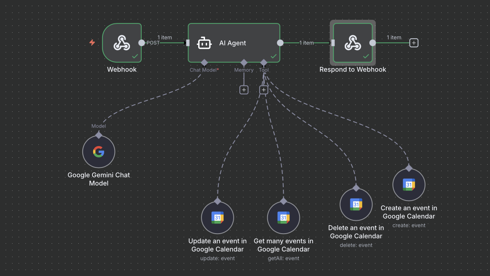

# Final Case Study
Automated Calendar Management using n8n + Gemini AI

---

## Introduction 

Scheduling coordination is one of the most common (and frustrating) administrative tasks among teams and student groups. When meeting times are changed, calendar updates are often forgotten, causing confusion and lost productivity.

This project implements an **AI-powered scheduling assistant** using:

- **n8n workflow automation**
- **Google Gemini** for natural language understanding
- **Google Calendar API**
- **Docker** for reproducible deployment

Users can submit **plain English scheduling requests** through a webhook like:

> “Move the project meeting from tomorrow at 5PM to tomorrow at 7pm”

The system then automatically:
1. Extracts intent & event details using AI  
2. Validates event info via Google Calendar  
3. Performs the appropriate calendar action  
4. Responds with a clear JSON confirmation  

**Outcome**: Fully automated calendar management triggered by natural language

---

## Problem & Motivation

Challenges with traditional scheduling:
- Natural language must be manually translated into structured dates/times
- Humans forget to update events
- Repetitive administrative tasks waste precious time

By **automating scheduling**, this assistant improves:
- Reliability  
- Speed  
- Coordination  
- User confidence  

---

## Solution Overview

The **Intelligent Scheduling Assistant** converts *unstructured messages* into *structured API actions*:

| User Input | System Output |
|-----------|---------------|
| “Cancel robotics meeting next week.” | Calendar event deleted |
| “Schedule a study group Friday at 4pm.” | Calendar event created |
| “Move the project meeting from tomorrow at 5PM to tomorrow at 7pm.” | Existing event updated |

- Integration-ready Webhook API  
- Human-editable data store  

---

## System Architecture

### Tools Used (per course rubric)
✔ n8n automation  
✔ LLM prompt engineering  
✔ Webhook trigger  
✔ Google Calendar API  
✔ Docker container deployment  
✔ Testing & monitoring

### Architecture Diagram  


---

## How It Works 

1. Webhook receives message from user  
2. Gemini AI Agent parses the request into:  
  - action (create/update/delete/query)  
  - event_name, start_time, end_time, timezone
3. Google Calendar node executes action  
4. JSON response returned to user  
5. Metrics logged for observability

---

## 📦 Deployment & Execution

### Run Using Docker (local)

```bash
cd docker
./run.sh up
```

---

## Demonstration Screenshots

### Example Webhook Response


### Calendar Event Confirmation


